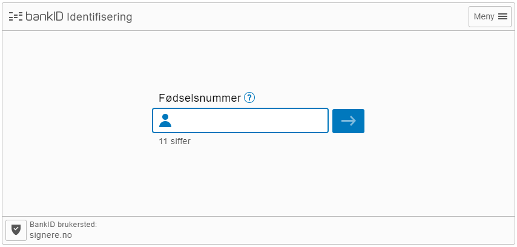

# REST API Flow

The REST API provides endpoints that lets you implement identification with only a few API calls. Alternatively you can use one of our available [SDKs](https://developer.idfy.io/sdk).

See our [API reference](https://developer.idfy.io/api#tag/Identification-Endpoint) for detailed information about all the available endpoints and properties.

## Quickstart

Follow these three steps to identify a user:

1. [Create a new identification session](./#step-1-create-a-new-identification-session)
2. [Direct the user to the returned URL](./#step-2-direct-the-user-to-the-returned-url)
3. [Retrieve identified user data](./#step-3-retrieve-identified-user-data)

### Step 1: Create a new identification session

When creating a new session, you can choose whether or not you want to specify which eID provider the user must use when identifying themselves. If no eID provider is specified, the user will be able to choose between all available providers associated with your Idfy account. In this example we will use Norwegian BankID.

```text
POST https://api.idfy.io/identification/session
```

Sample request body:

```text
{
  "IdentityProvider": "NO_BANKID_WEB",
  "ReturnUrls": {
    "Error": "https://secure.wayneenterprises.com/auth/error?status=[0]",
    "Abort": "https://secure.wayneenterprises.com/auth/abort?requestid=[1]&externalid=[2]",
    "Success": "https://secure.wayneenterprises.com/auth/success?requestid=[1]&externalid=[2]"
  },
  "Language": "NO",
  "GetSocialSecurityNumber": true
}
```

In the request we also specify the URL that the user is redirected to after the identification is completed, aborted by the user, or if an error occurs. Placeholders can be added to these URLs and will be replaced upon redirect.

A successful call returns the URL which the user must be redirected to in order to complete the identification process, as well as the unique ID for the session.

### Step 2: Direct the user to the returned URL

When directing the user to the URL returned from step 1, the Norwegian BankID login interface is displayed:


You can also create an iframe with the url, but then you have to specify domain in the request.


### Step 3: Retrieve identified user data

After the identification process is complete and the user is redirected back to the specified `successUrl`, the session and associated user data can be retrieved with the unique session ID:

```text
GET https://api.idfy.io/identification/session?requestId={ID}
```

Sample response body:

```text
{
  "Name": "Wayne, Bruce Thomas",
  "FirstName": "Bruce",
  "MiddleName": "Thomas",
  "LastName": "Wayne",
  "DateOfBirth": "010740",
  "Status": "SUCCESS",
  "SocialSecurityNumber": "01074012345",
  "IdentityProviderUniqueId": "9875-4000-1-54321",
  "IdentityProvider": "NO_BANKID_WEB",
  "EnvironmentInfo": {
    "UserAgent": "Mozilla/5.0 (iPhone; CPU iPhone OS 10_0_2 like Mac OS X) AppleWebKit/602.1.50 (KHTML, like Gecko) Mobile/14A456",
    "IPAddress": "127.0.0.1"
  }
  "RequestId": "25191832985138881678wuuPNTgWL4Aq7R"
}
```

