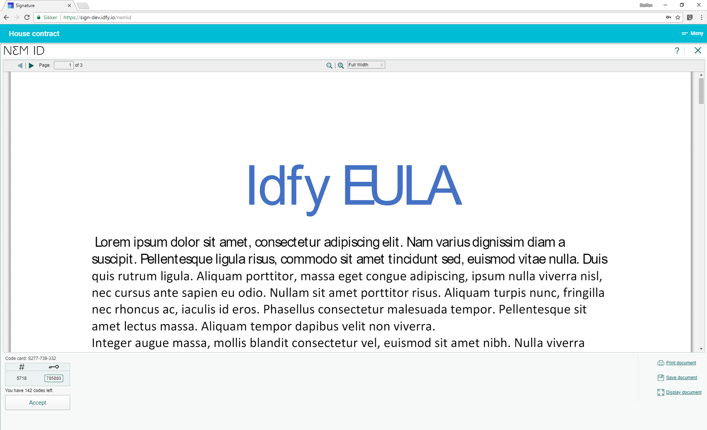

# Danish NemID

NemID is a danish common secure login on the Internet, whether you are doing your online banking, finding out information from the public authorities or engaging with one of the many businesses that use NemID.

Website: [https://www.nemid.nu/dk-en/](https://www.nemid.nu/dk-en/)

## Capabilities

NemID supports both identification and signature.

## Legal

## Certificate

## Screenshots from signing and identification process

### Identification

### Signing

## Technical

#### Test users

If you need test users for NemID, please contact support@idfy.io

#### Signature format

XMLDSig is the native format for Danish NemID. It also support packaging to PAdES \(PDF Advances Electronic Signature\).

