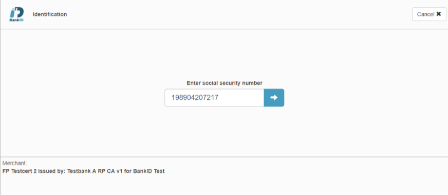
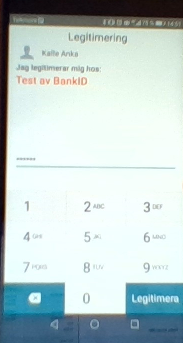
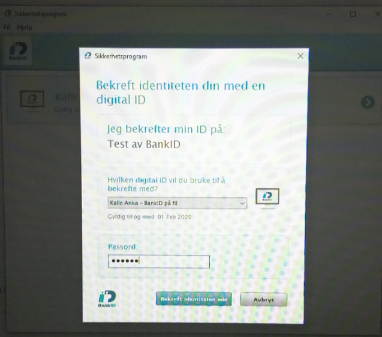
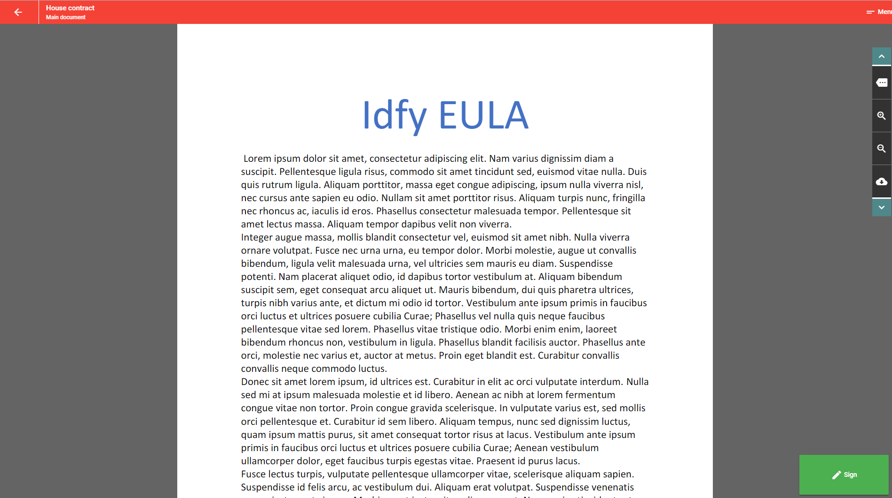
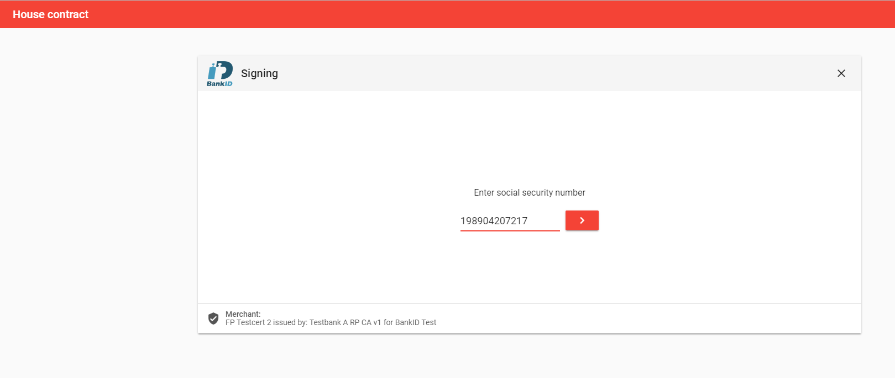
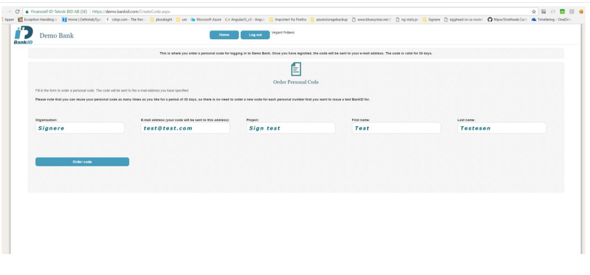
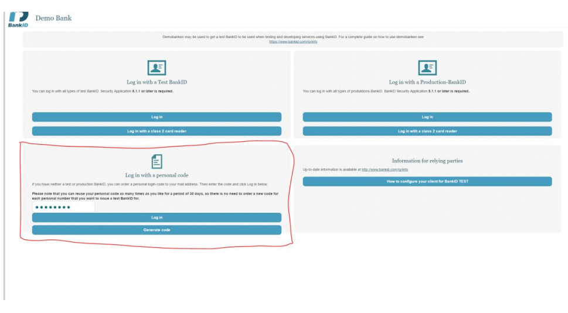

# Swedish BankID

BankID is the leading electronic identification in Sweden, but BankID has been developed by a number of large banks for use by members of the public, authorities and companies.

Swedish BankID has 7,5 million active users. Many services are provided where citizens can use their BankID for digital identification as well as signing transactions and documents. The services vary from online and mobile banking, e-trade to tax declaration and are provided by government, municipality, banks and companies. Swedish BankID is used both for identification as well as signing. According to Swedish law, and within the European Union, BankID is an advanced signature and a signature made with a BankID is legally binding. Swedish BankID is available as a soft certificate and as an app for smartphones and tablets.

Website: [https://www.bankid.com/en/](https://www.bankid.com/en/)

### BankID

Bankid säkerhetsprogram is available for download from this location:

[https://install.bankid.com/](https://install.bankid.com/)

### BankID on mobile

BankID säkerhetsapp is available for download from the following locations:

Android version: [https://play.google.com/store/apps/details?id=com.bankid.bus](https://play.google.com/store/apps/details?id=com.bankid.bus)

iOS: [https://itunes.apple.com/se/app/bankid-s%C3%A4kerhetsapp/id433151512?mt=8](https://itunes.apple.com/se/app/bankid-säkerhetsapp/id433151512?mt=8)

## Capabilities

Swedish BankID supports both identification and signature.

## Legal

## Certificate

## Screenshots from signing and identification process

### Identification BankID on mobile

Mobile:

Desktop:

### Signing

## Technical

#### Test users

1. Go to [http://www.personnummer.nu/](http://www.personnummer.nu/) and generate a new social security number.

2. Go to 

[https://demo.bankid/CreateCode.aspx](https://demo.bankid/CreateCode.aspx)

 and fill out this form, you will then recive a personal code that is valid for 30 days.

3. Go to 

[https://demo.bankid.com/](https://demo.bankid.com/)

 and configure your bankid client. Click on how to configure your client for BankID test system. Follow the instructions for your device.

1. Login with the personal code you received in step 2 \(check your email inbox\)

5. Issue a new bankid with the social security number you generated.

6. Add the new bankid in your client application and you are good to go

!

#### Signature format

