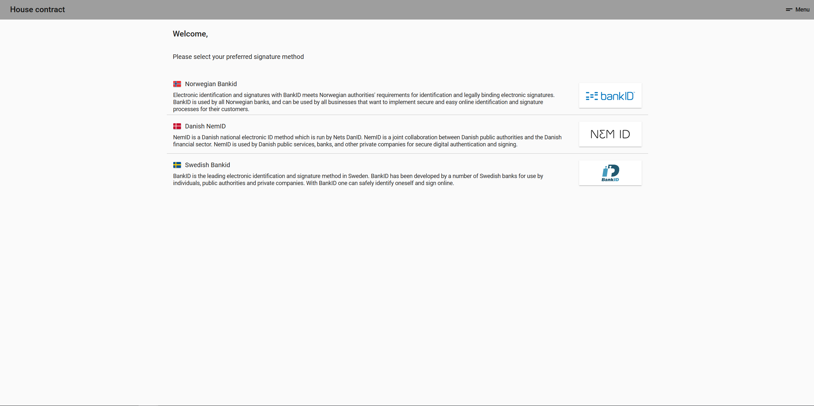
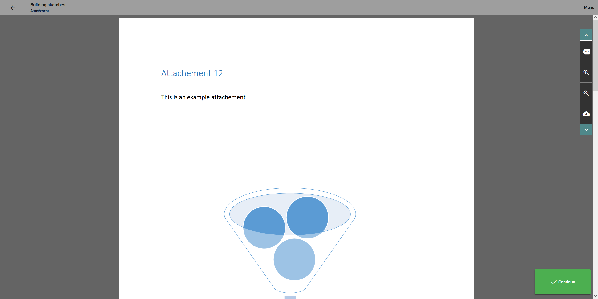

# Attachments

In a lot of cases you have to make sure the signer retrieves attachments in addition to the main document to be sign. Don't worry, our signature API also supports attachments.

## Attachment format

The attachment must be a pdf file

## Attachment-types

When you upload an attachment you must decide which attachment-type you want to use. The default value is "show\_accept"

You can choose between 3 types of attachments:

| Type | Description | Remarks |
| :--- | :--- | :--- |
| show\_accept | The signer will see the attachment, and have to click a continue button before they get to the main document | Default value |
| read\_accept | The signer have to click on a checkbox to confirm that they have read and understood the attachment content | Coming soon |
| sign | The signer have to sign the attachment with the same signature method as the main document. | Coming soon&lt;br&gt;Extra cost per signature |

## Implementation guide

See our [Sign multiple documents scenario](/sign/sign-scenarios/sign-multiple-documents.md)

### Application screenshots

